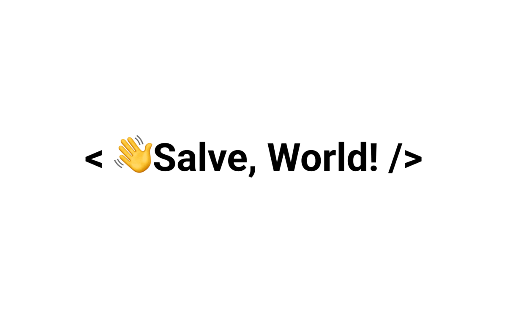

  

<h1 align="center">Hi, I'm Alberto</h1>
<h2 align="center">A passionate Front-end Developer from Italy</h2>

 

# 💫 About Me:
- 🌱 I’m currently learning **Javascript and Vue.js**

- 👨‍💻 All of my projects are available **on my [website](https://www.albertofabro.com/projects) and on my [github](https://github.com/Eiliv17)**

- 📝 I often write articles **on [my website blog section](https://www.albertofabro.com/blog)**

- 📫 You can reach me **through my [website contact form](https://www.albertofabro.com/contact) or via [email](mailto:alberto.fabro@outlook.com)**

## 🌐 Socials:

 

 
 

# 💻 Tech Stack:

<table style="width: 100%">
    <thead>
        <tr>
            <th>Front-end</th>
            <th>Back-end</th>
            <th>Other Languages & Tools</th>
        </tr>
    </thead>
    <tbody valign="top" style="width: 100%">
        <tr>
            <td style="width: 33%">
                
                
                
                
                
                
            </td>
            <td style="width: 33%">
                
                
                
            </td>
            <td style="width: 33%">
                
                
                
                
                
                
                
                
                
                
                
            </td>
        </tr>
    </tbody>
</table>

# 📊 GitHub Stats:

    
     
    
     
    

